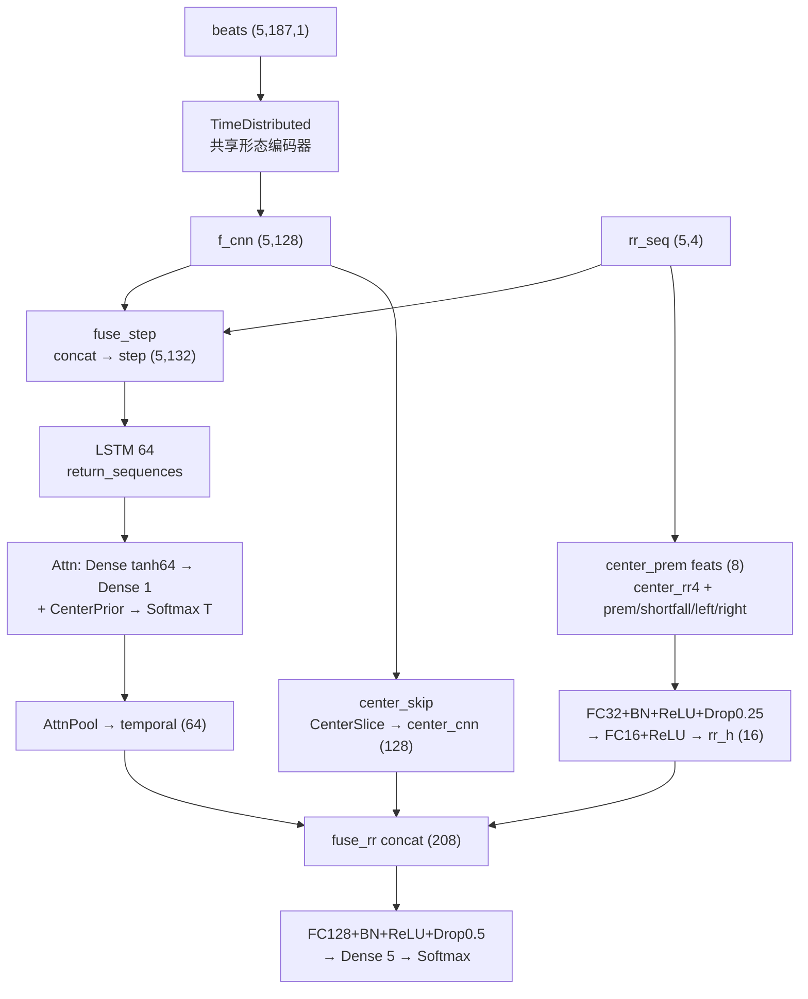
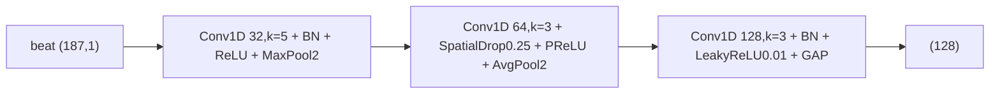

# FT-CNN (MIT-BIH AAMI 5-class)

Protocol-faithful reproduction of the Biosensors 2026 FT-CNN for ECG arrhythmia classification.

Morphology branch (single beat 187 pts) + RR-interval branch (4-dim) → 5-class softmax (N / S / V / F / Q).

## 1. v3.2 模型结构 (CNN-LSTM center_prem dual RR)

v3.2 配置：`config/cnn_lstm_v3_2.yaml`，`context.half_window=2 → T=5`，`lstm_units=64`，`use_attention=true`，`center_skip=true`，`center_attn_boost=1.5`，`prior_as_weight=true`，`rr_branch=true`，`rr_branch_units=32`，`rr_branch_dropout=0.25`，`rr_branch_mode=center_prem`，`keep_step_rr=true`，`dense_dropout=0.5`。

双输入：`beats (5,187,1)` + `rr_seq (5,4)`，单输出 `Softmax(5)`，按中心心拍标签训练。



共享形态编码器（每拍复用，与 FT-CNN Block1–3 同结构）：



对应代码：`src/models/cnn_lstm.py::build_cnn_lstm()` + `build_morphology_encoder()` + `rr_center_prematurity_features()` + `CenterPriorAdd/AttnPool/CenterSlice`。

## 2. v3.2 网络细节参数 (Network Details)

`beats` 卷积初始化 `he_normal`，`padding="same"`，池化 `pool 2 / stride 2`；LSTM `tanh/sigmoid` 默认初始化，`dropout=0.25, recurrent_dropout=0`；注意力 `Dense(64,tanh)→Dense(1)` + 固定中心先验 `prior=[0.5,1.0,1.5,1.0,0.5]` 相加后 `Softmax(T)`；`center_prem` 显式早搏特征 8 维；全连接 `he_normal`（末层 `glorot_uniform`）。

| 层数 | 类型 | 输出大小 | 步长 | 卷积核 / 备注 |
|------|------|----------|------|---------------|
| 1 | 输入 beats | (None,5,187,1) | - | 连续 5 心拍，中心±2 |
| 2 | 输入 rr_seq | (None,5,4) | - | 每拍 [pre_RR, post_RR, local_avg(10), ratio] |
| 3 | TD-Conv1 | (None,5,187,32) | 1 | 5×1, same, he_normal, L2 1e-4，共享权重 |
| 4 | TD-BN1+ReLU | (None,5,187,32) | - | - |
| 5 | TD-MaxPool1 | (None,5,93,32) | 2 | pool 2 |
| 6 | TD-Conv2 | (None,5,93,64) | 1 | 3×1, same, he_normal, L2 1e-4 |
| 7 | TD-SpatialDropout+PReLU | (None,5,93,64) | - | dropout 0.25，逐通道 PReLU |
| 8 | TD-AvgPool2 | (None,5,46,64) | 2 | pool 2 |
| 9 | TD-Conv3+BN+Leaky | (None,5,46,128) | 1 | 3×1, same, α=0.01 |
| 10 | TD-GAP f_cnn | (None,5,128) | - | 时间维平均 |
| 11 | 逐拍融合 fuse_step | (None,5,132) | - | concat(f_cnn 128, rr_seq 4)，`keep_step_rr=true` |
| 12 | LSTM | (None,5,64) | - | units 64, dropout 0.25, return_sequences |
| 13 | 注意力隐层 | (None,5,64) | - | Dense 64, tanh |
| 14 | 注意力打分+中心先验 | (None,5,1) | - | Dense 1 + prior [0.5,1.0,1.5,1.0,0.5]，`CenterPriorAdd` 可加载旧权重 |
| 15 | 注意力权重 | (None,5,1) | - | Softmax(axis=1) |
| 16 | 注意力池化 temporal | (None,64) | - | Σ attn·seq |
| 17 | 中心跳过 center_cnn | (None,128) | - | `f_cnn[:,2,:]`，`center_skip=true` |
| 18 | RR显式特征 | (None,8) | - | center_rr(4)+prem(1)+shortfall(1)+left(1)+right(1) |
| 19 | RR-FC1+BN+ReLU+Dropout | (None,32) | - | he_normal, L2 1e-4, dropout 0.25 |
| 20 | RR-FC2+ReLU rr_h | (None,16) | - | he_normal, L2 1e-4 |
| 21 | 融合 fuse_rr | (None,208) | - | concat(temporal 64, center_cnn 128, rr_h 16) |
| 22 | FC128+BN+ReLU+Dropout | (None,128) | - | he_normal, L2 1e-4, dropout 0.5 |
| 23 | Logits Dense | (None,5) | - | glorot_uniform |
| 24 | Softmax | (None,5) | - | N / S / V / F / Q，`temperature=1.0` |

> 与 DMMF-Net 图 5 / 表 2 的对应关系：v3.2 的层 3–10 ≈ 其层 2–9（卷积+池化 tower，但 v3.2 为 `TimeDistributed×5` 共享）；层 12–16 ≈ 其 `Multi-Head Attention`（v3.2 为单头加性注意力+固定中心先验+加权池化，无多头、无 CA-GAP/GMP）；无其 `11-14 残差块/短接卷积`、`CA-FC1/FC2`；v3.2 层 17–20 为 FT-CNN 系独有的 `center_skip + center_prem RR 支路`；层 21–24 ≈ 其 `FC1/FC2/Softmax`（v3.2 为 `208→128→5`）。


## Setup

```bash
cd FT-CNN
python -m venv .venv
# Windows: .venv\Scripts\activate
pip install -r requirements.txt
```

Edit `config/default.yaml` → `paths.data_root` for AutoDL.

## Local smoke

```bash
pytest -q
python scripts/smoke_test.py
```

## AutoDL full run

```bash
python scripts/build_cache.py
python -m src.train
python -m src.eval --checkpoint artifacts/checkpoints/best.h5
```

See `REPRO_NOTES.md` for paper gaps and metric deltas.
